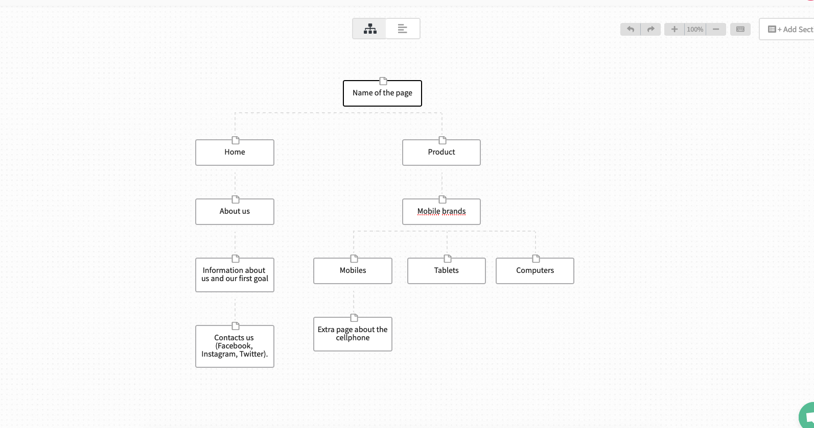
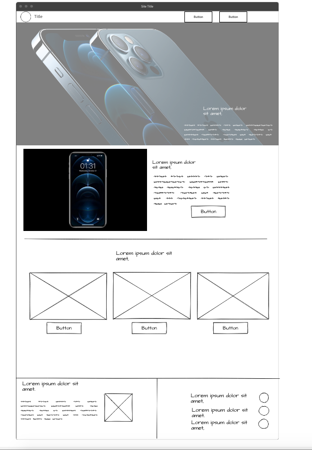
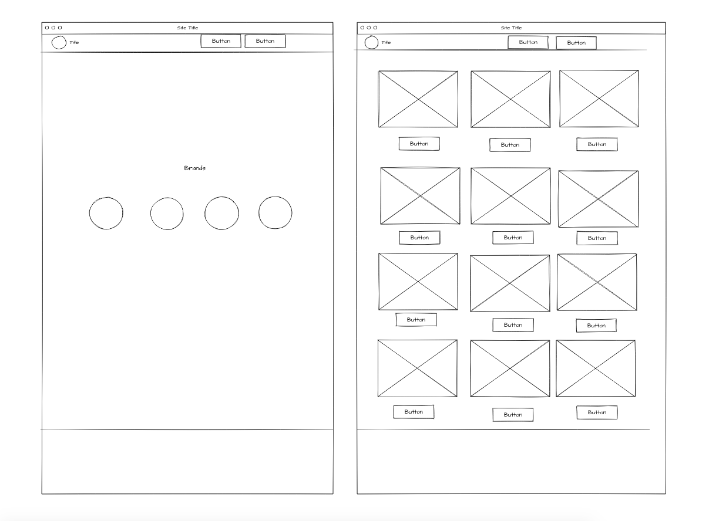

# SITE MAP

---

# PROTOTYPE.

---

# THINK ABOUT.

### Which are the 6 steps from Web Design?

> Step 1: Discovery / Gathering Information about the Topic of your web.
		> Purpose
		> Goals
		> Target Audience
		> Content
> Step 2: Planning.
		> Using the information Gathered for put a plan.
> Step 3: Design.
		> Drawing from the information gathered.
> Step 4: Development.
		> Functional web site created.
> Step 5: Testing and Delivery.
		> Attend to the final details and test the web site.
> Step 6: Maintenance.

### What are principal objective?

> The principal objective is know how to do a good web site for the user.

### What kind of public do you believe that going to interest in the web site?

> It's for all the public.

### Which is the principal action that the User going to do in your web site?

> Search about mobiles, computers and tablets.

### Which are the most important experience for the user?

> See a dynamic and interactive web site.

### What part of the mission was boring for you?

>  None part of the mission was boring for me.

---

# EXPLAIN WITH YOUR OWN WORDS.

> Browser: It's a element to sail to internet. 
> DNS: It's a decentralized system to connected dispositives.
> Domain: We can identify any subarea of internet with the Domain. This traduced the IP to find the web site very easy.
> Internet: It's a group of nets to communicate between them.
> IP address: It's a group of numbers that identify any interface of the net.
> Web app: It's a tool in which the user can use in a web server.
> Web server: It's a program that process any applications from the server.
> Website: It's a collection of web sites associated and commons in a internet domain.
> World Wide Web:  It's a distribution system of hypertext documents interconnected and accessible by internet.

